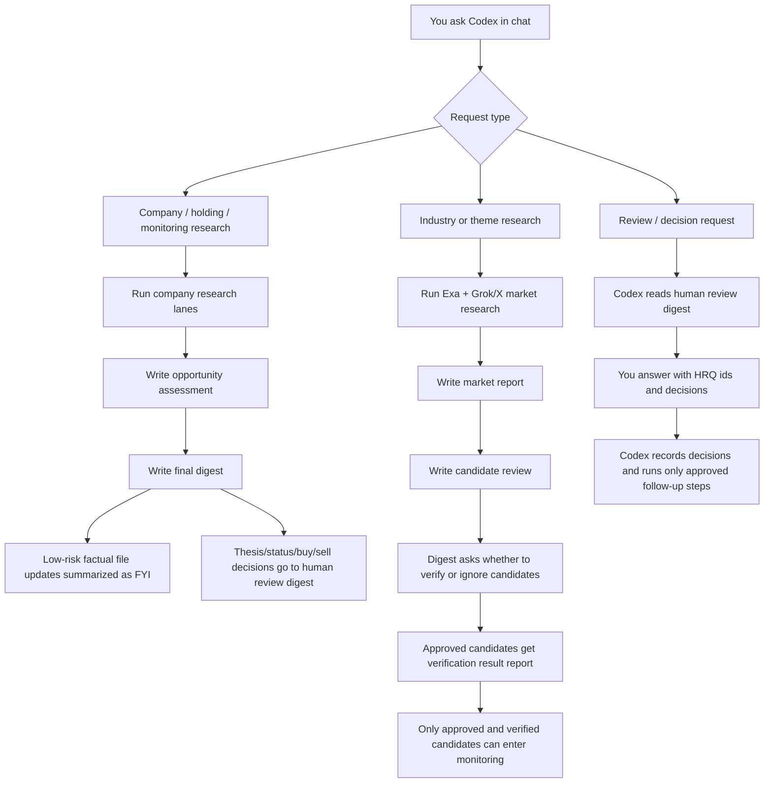

# Human Usage Guide

Last updated: 2026-05-17

## Short Version

Use Codex chat as the interface.

You do not need to manually edit files for normal use. Open this repo in Codex and ask in plain language:

```text
Research ASML, TSM, AMD, and SAP. Add them to monitoring if useful and summarize what you found.
```

or:

```text
Run market research on European semiconductor equipment suppliers. Include Exa/web and Grok/X sentiment, surface interesting companies, and tell me what needs review.
```

Codex should read the repo context, run the relevant workflow, write durable artifacts, and summarize where the results are.

## What The Main Reports Mean

For weekly-style holding/watchlist research:

- `codex_supervised_review.md` is the best first read after the scheduled Codex automation finishes. It is written by Codex after reading the deterministic review pack, final digest, opportunity assessments, quality report, memory/finalization artifacts, and human-review digest.
- `final_digest.md` is the quick read. It summarizes each current holding and monitored stock from the latest run, including the most important opportunity view, financial facts, news, Grok/X pulse, bull/bear case, and links to deeper reports.
- `reports/opportunity_assessment/{TICKER}_opportunity_assessment.md` is the main human-facing deep company report. Read this when the digest says a stock needs attention or when you want the full thesis, X/community narrative, valuation context, non-obvious angles, and next research checks.
- `company_research/{TICKER}_company_research.md` is mostly an internal orchestration packet. It shows which specialist lanes ran or missed. You normally do not need to read it unless Codex points you there while debugging coverage.
- `company_file_factual_updates.md` is an FYI summary of low-risk company-file facts that were synced automatically.

For market/industry/theme research:

- `market_research/*_manual_market_research.md` is the human-facing market report.
- `market_research/candidate_review.md` is the evidence bridge behind discovered candidate stocks.
- `agents/human_review_digest.md` is the inbox for decisions and FYI update summaries.
- `human_review_digest_summary.md` inside a run folder is the run-local pointer back to the current decision inbox.

For candidate verification:

- Approving a Grok/X or Exa-only candidate starts deeper verification. It does not add the stock to monitoring.
- Verification results are written to `agents/runs/{run_id}/market_research/candidate_verification_result.md`.
- After verification, Codex should summarize the result and recommend `add to monitoring`, `reject`, or `needs_more_research`.
- Adding to monitoring is a separate approved step and creates/updates `stock_tracking/monitoring/monitoring.csv` plus a company file.

For quick stock intake:

- Use the Google Sheet `new_stock_overview` as the fast place to capture stocks you come across.
- Ask Codex to fill one Sheet row from a pasted paragraph or source link.
- Review the Sheet every one or two weeks and set `action=research` only for rows you want Codex to process.
- Codex should process those marked rows only when you explicitly ask it. Nothing should auto-run from a Sheet edit.
- After research, use `action=add to monitoring`, `bought`, `ignore`, or `rejected` to show the final routing.




## What To Ask Codex

### 0. Capture A Stock Idea In The Sheet

Ask:

```text
Add this stock idea to the Google Sheet. Score it B, available yes. Fill missing basics with web search and keep the comment short: [paste paragraph/link]
```

What Codex should do:

- fill a new row in `new_stock_overview`,
- keep `Comment` to a few skim-friendly sentences,
- use `Score` as your personal interest grade,
- use `available` only for broker availability,
- leave `action` blank unless you already want it queued for research.

When you later want rows processed, set `action=research` in the Sheet and ask:

```text
Process the rows in the Sheet marked action=research and create candidate review items.
```

Codex should turn those rows into repo candidate-review artifacts. It should not add them to monitoring, holdings, or rejected state without a separate decision.

### 1. Research Specific Stocks

Ask:

```text
Research ASML, TSM, AMD, and SAP. Add missing names to monitoring, run available company research, and summarize the results.
```

What Codex should do:

- add missing stocks to `stock_tracking/monitoring/monitoring.csv` when appropriate,
- create company files under `stock_tracking/stock_info_files/monitoring/`,
- run available company research if you asked for immediate research,
- summarize findings in chat,
- save deeper outputs under `agents/runs/{run_id}/`.

Where to read later:

- company-level notes: `stock_tracking/stock_info_files/`
- latest run reports: `agents/runs/{run_id}/`
- pending decisions: `agents/human_review_digest.md`

### 2. Research An Industry Or Theme

Ask:

```text
Run market research for grid-scale energy storage in Europe. Use Exa and Grok/X, find candidate stocks, and create review items for anything promising.
```

What Codex should do:

- run the manual market-research workflow,
- use Exa/web for verification-oriented research,
- use Grok/X for hype, sentiment, rumors, and niche leads,
- write a market report,
- create candidate review items when stocks need your decision.

Where to read later:

- market report: `agents/runs/{run_id}/market_research/`
- recurring topic files: `market_research/industries/` or `market_research/themes/`
- candidate decisions: `agents/human_review_digest.md`

### 3. Add A Recurring Research Priority

Ask:

```text
I think nuclear SMRs will matter next year. Add this as a recurring research priority and include it in future market research.
```

What Codex should do:

- update `strategy/research_priorities.md`,
- create or update a theme file under `market_research/themes/`,
- record the request in `docs/plans/human_research_requests.md`,
- tell you whether it needs a strategy-review approval.

### 4. Review What Needs Your Decision

Ask:

```text
Show me my open human review digest and explain what I need to decide.
```

Codex should read:

```text
agents/human_review_digest.md
```

Then it should summarize only the open decisions.

You can answer:

```text
Approve HRQ-0007 for verification, reject HRQ-0008, and leave HRQ-0009 open.
```

Codex should record that decision. Recording a decision does not automatically trade or promote a stock. Follow-up actions stay approval-gated.

Company-file updates are different:

- Low-risk factual updates should be applied by Codex/the scoped writer and summarized as FYI.
- Thesis changes, opinion changes, stock-status moves, strategy changes, buy/sell decisions, and ambiguous edits still need your review.

Allowed decisions:

- `approve`
- `reject`
- `needs_more_research`
- `leave_open`
- `supersede`

### 5. Get A Portfolio Or Watchlist Update

Ask:

```text
Give me a portfolio review from the latest run. Focus on holdings, monitored stocks, open review items, and what needs attention this week.
```

Codex should use:

- `stock_tracking/current_holdings/`
- `stock_tracking/monitoring/`
- `stock_tracking/rejected/`
- latest `agents/runs/{run_id}/portfolio_review/portfolio_review.md`
- `agents/human_review_digest.md`

The portfolio review report is not your main inbox. It is deeper context. Your main inbox is still `agents/human_review_digest.md`.

### 6. Run The Weekly-Style Workflow Manually

Ask:

```text
Run the weekly research workflow manually for the current repo state. Use fresh providers if possible, then summarize results and open review items.
```

What Codex should do:

- run the lower-cost Codex-supervised weekly workflow from the repo:

```powershell
C:\Python313\python.exe -m stock_research run-weekly --write --execute-providers --execute-analysis
```

- read the generated `agents/runs/{run_id}/codex_supervised_review_pack.md`,
- write or update `agents/runs/{run_id}/codex_supervised_review.md`,
- write reports under `agents/runs/{run_id}/`,
- refresh the review digest,
- summarize what changed and what you need to decide.

Where to read:

- start with `agents/runs/{run_id}/codex_supervised_review.md` when the Codex automation/manual run completed the supervised review step,
- then read `agents/runs/{run_id}/final_digest.md` for the quick per-stock digest,
- open `agents/runs/{run_id}/reports/opportunity_assessment/{TICKER}_opportunity_assessment.md` for any stock that matters,
- use `agents/human_review_digest.md` for decisions and FYI update summaries.

The API SDK workflow is still available when you explicitly ask for an API-mode benchmark or remote/headless simulation, but it is not the default Codex app workflow.

## Where Results Live

Use this simple map:

| Need | Main place |
| --- | --- |
| Best first read after scheduled Codex automation | `agents/runs/{run_id}/codex_supervised_review.md` |
| What needs my decision? | `agents/human_review_digest.md` |
| Durable review queue | `agents/human_review_queue.md` |
| Latest run outputs | `agents/runs/{run_id}/` |
| Specific company knowledge | `stock_tracking/stock_info_files/` |
| Category state summaries | `stock_tracking/current_holdings/current_holdings_state.md`, `stock_tracking/monitoring/monitoring_state.md`, `stock_tracking/rejected/rejected_state.md` |
| Current holdings overview | `stock_tracking/current_holdings/current_holdings.csv` |
| Monitoring overview | `stock_tracking/monitoring/monitoring.csv` |
| Rejected/cooldown overview | `stock_tracking/rejected/rejected.csv` |
| Industry/theme research | `market_research/industries/`, `market_research/themes/` |
| Strategy and priorities | `strategy/` |
| Your proactive requests | `docs/plans/human_research_requests.md` |
| Quick stock idea inbox | Google Sheet `new_stock_overview` |
| Archived artifact index | `archive/research_index.md` |

## Normal Human Workflow

1. Open this repo in Codex.
2. Ask a natural-language request.
3. Codex runs or queues the right workflow.
4. Codex summarizes the result in chat.
5. Start with the final digest or market report.
6. Open the opportunity assessment only when you want deeper company detail.
7. For decisions, ask Codex to show `agents/human_review_digest.md`.
8. Tell Codex which HRQ items to approve, reject, mark for more research, or leave open.
9. If you decide to buy, sell, move to monitoring, or reject a stock, say that plainly in Codex chat. Codex should update the relevant CSV/state/company files and preserve the decision trail.

## Good Prompts

```text
Research these stocks now: ASML, TSM, AMD, SAP. Create or update monitoring files and tell me what needs human review.
```

```text
Run market research on European defense electronics. Include Exa and Grok/X, surface candidate stocks, and create candidate review items.
```

```text
Show me open human review items. Group them by decision type and recommend what I should look at first.
```

```text
Approve HRQ-0007 for verification and mark HRQ-0008 as needs_more_research because I want more filing evidence.
```

```text
Give me the latest summary for AAPL from our company file and latest run artifacts.
```

```text
Add humanoid robotics as a recurring research theme and explain which files you updated.
```

## Practical Rules

- Tell Codex whether you want immediate research or just to add something for future tracking.
- For quick ideas, use the Sheet first; set `action=research` only when you want Codex to process selected rows.
- Do not manually inspect every report unless you want detail. Start with the chat summary and `agents/human_review_digest.md`.
- Use HRQ IDs when making decisions.
- Do not approve vague batches if you are unsure. Ask Codex to explain the evidence for specific HRQ items.
- Research output is not a trade instruction. Buy, sell, and position-size decisions stay human-approved.

## If You Start A New Codex Chat

Start with:

```text
Read AGENTS.md and docs/HUMAN_USAGE_GUIDE.md first. Then show me the current status and open human review digest.
```

For a new task, you can simply ask the task directly. `AGENTS.md` tells Codex to load repo memory, the repo map, relevant scratchpads, and planning files before acting.
