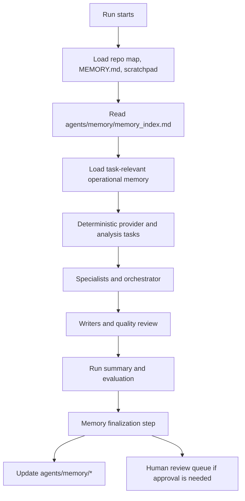

# Agent Memory Workflow

Last updated: 2026-05-05

## Purpose

`agents/memory/` is the operational learning layer for the stock research system. It stores agent-performance lessons, workflow lessons, source-quality notes, specialist procedures, evaluation patterns, and deprecated behavior.

It is not another store for investment facts.

Investment facts belong in:

- company files under `stock_tracking/stock_info_files/`,
- category state files under `stock_tracking/current_holdings/`, `stock_tracking/monitoring/`, and `stock_tracking/rejected/`,
- strategy files under `strategy/`,
- evidence packets under `agents/runs/*/evidence_packets/`,
- durable repo decisions in `MEMORY.md`.

## Design Model

The memory layer follows a lightweight layered-memory model:

- short-term memory: current chat/run context and run artifacts,
- semantic memory: stable repo decisions in `MEMORY.md`,
- episodic memory: past workflow outcomes and user corrections in `agents/memory/`,
- procedural memory: better tool-selection and specialist instructions in `agents/memory/`,
- source-quality memory: provider reliability and gotchas in `agents/memory/source_quality.md`.

The current implementation is structured Markdown plus deterministic Python inspection commands. Do not add a vector database until memory volume becomes too large for reliable file-based review.

## Files

```text
agents/memory/
  README.md
  memory_index.md
  orchestrator_lessons.md
  source_quality.md
  specialist_playbooks.md
  evaluation_metrics.md
  deprecated_memory.md
```

Optional future growth path:

```text
agents/memory/items/YYYY-MM-DD_memory-id.json
```

## Read Flow

At task start, Codex or the orchestrator should read:

1. `MEMORY.md`
2. `docs/descriptions/repo_map.md`
3. the relevant scratchpad in `docs/scratchpads/`
4. `agents/memory/memory_index.md`
5. only the relevant memory files listed by the index

The deterministic CLI can select task-relevant memory:

```powershell
python -m stock_research memory context --task financial
python -m stock_research memory context --task sentiment
python -m stock_research memory context --task quality
```

Examples:

- Financial specialist: `source_quality.md` and `specialist_playbooks.md`.
- Company news specialist: `source_quality.md` and `specialist_playbooks.md`.
- Orchestrator: `orchestrator_lessons.md`.
- Quality reviewer: `evaluation_metrics.md`, `source_quality.md`, and `deprecated_memory.md`.
- File updater: `specialist_playbooks.md` and the relevant repo docs/templates.

## Write Flow

Use two write paths:

1. Hot-path memory writes.
   - Use immediately for high-impact user corrections or dangerous repeated mistakes.
   - Example: direct X.com API was corrected and replaced by xAI/Grok `x_search`.
2. Post-run reflection.
   - After weekly/manual runs, review provider failures, low-value output, user corrections, noisy alerts, citation gaps, successful prompts, and repeated workflow issues.
   - Add, update, supersede, or deprecate memory items.

Major memory changes that affect strategy, approval gates, or high-impact workflow behavior should create a human review item in `agents/human_review_queue.md`.

## Pending Automation

The current memory layer can be read, validated, summarized, filtered by task, formatted for prompt injection, updated through deterministic add/deprecate commands, reflected on after a run, checked for recurring failure patterns across reflected runs, drafted into schema-valid memory updates, reviewed by a bounded LLM memory writer, finalized with one deterministic command, and invoked by the deterministic weekly runner. The following automation is still pending:

- orchestrator runtime invocation of `memory prompt-context --task TASK` for each specialist prompt.
- OS/app scheduled execution of `python -m stock_research run-weekly`.

Until orchestrator automation is implemented, Codex should use the deterministic commands for structured memory changes, then run:

```powershell
python -m stock_research memory validate
```

## Memory Item Fields

Use `docs/templates/agent_memory_item_template.md`.

Required fields:

```text
- id:
- date:
- type: semantic | episodic | procedural | source_quality | evaluation
- scope: orchestrator | provider | financial | news | sentiment | writer | global
- status: active | superseded | deprecated | needs_review
- confidence: low | medium | high
- trigger/source:
- lesson:
- use_when:
- do_not_use_when:
- evidence:
- owner:
- next_review:
```

## Guardrails

- Do not store secrets, tokens, API keys, broker data, or private account data.
- Do not store raw provider output; link to evidence packets or raw run artifacts instead.
- Do not store company facts unless the memory is about source reliability or workflow behavior.
- Prefer updating an existing item over duplicating it.
- If a memory is wrong, mark it `superseded` or move it to `deprecated_memory.md`.
- Keep memories short, actionable, and evidence-backed.

## Deterministic Commands

```powershell
python -m stock_research memory summary
python -m stock_research memory validate
python -m stock_research memory context --task TASK
python -m stock_research memory add ...
python -m stock_research memory deprecate --id ITEM_ID --reason "..."
python -m stock_research memory reflect-run --run-id RUN_ID --write
python -m stock_research memory recurring-failures --write
python -m stock_research memory finalize-run --run-id RUN_ID
python -m stock_research memory draft-updates --run-id RUN_ID --write
python -m stock_research memory apply-updates --run-id RUN_ID --proposal-id PROPOSAL_ID
python -m stock_research memory prompt-context --task TASK
python -m stock_research memory writer-prompt --run-id RUN_ID --write
python -m stock_research memory writer-review --run-id RUN_ID --write
python -m stock_research memory writer-review --run-id RUN_ID --execute --write --update-drafts
python -m stock_research run-weekly --write
```

Current task hints include:

- `financial`
- `news`
- `sentiment`
- `provider`
- `orchestration`
- `specialist`
- `writer`
- `quality`
- `learning`
- `all`

Use `memory add` for new structured memories and `memory deprecate` when a prior memory item should no longer guide future work. Manual Markdown edits are still acceptable for prose-only documentation or complex memory refactors that need human review.

Use `memory reflect-run` after weekly/manual runs to create `memory_reflection.json` and `memory_reflection.md`. The reflection command proposes memory updates; it does not apply them automatically.

Use `memory recurring-failures` after several reflected runs exist. It scans `memory_reflection.json` artifacts, detects repeated issue categories across distinct runs, and writes `agents/memory/recurring_failures.json` plus `agents/memory/recurring_failures.md` when `--write` is passed.

Use `memory draft-updates` to convert reflection and recurring-failure proposals into validated draft items under:

- `agents/runs/{run_id}/memory_update_drafts.json`
- `agents/runs/{run_id}/memory_update_drafts.md`

Draft items can be `ready` or `blocked`. Blocked items are usually duplicates, invalid schema, or unsupported proposal actions. Apply only approved ready items:

```powershell
python -m stock_research memory apply-updates --run-id RUN_ID --proposal-id PROPOSAL_ID
python -m stock_research memory apply-updates --run-id RUN_ID --all
```

Use `memory prompt-context` when a future specialist or orchestrator needs prompt-ready operational memory:

```powershell
python -m stock_research memory prompt-context --task "news specialist"
```

Use `memory writer-prompt` and `memory writer-review` when reflection proposals need LLM-assisted cleanup before approval:

```powershell
python -m stock_research memory writer-prompt --run-id RUN_ID --write
python -m stock_research memory writer-review --run-id RUN_ID --write
```

For live LLM review, set `OPENAI_API_KEY` and pass `--execute`:

```powershell
python -m stock_research memory writer-review --run-id RUN_ID --execute --write --update-drafts
```

The bounded writer uses OpenAI Responses API structured output. It can accept, revise, or reject draft items, but it still does not write to `agents/memory/*.md`. Actual operational memory writes must go through `memory apply-updates`, which validates the schema again before appending memory items.

Use `memory finalize-run` as the normal deterministic end-of-run command. It writes:

- `agents/runs/{run_id}/memory_reflection.json`
- `agents/runs/{run_id}/memory_reflection.md`
- `agents/memory/recurring_failures.json`
- `agents/memory/recurring_failures.md`
- `agents/runs/{run_id}/memory_update_drafts.json`
- `agents/runs/{run_id}/memory_update_drafts.md`
- `agents/runs/{run_id}/finalization.json`
- `agents/runs/{run_id}/finalization.md`

The finalization artifact summarizes run-learning status, reflection issue counts, recurring failure counts, memory update draft counts, generated artifacts, and next actions. It does not apply proposed memory updates automatically.

## Workflow Integration



## Current Seeded Lessons

- Use xAI/Grok `x_search`, not direct X.com API.
- Run deterministic provider and analysis tasks before orchestrator synthesis.
- Use `financial_compare` before financial-data specialist conclusions.
- Treat Grok/X output as social signal, not verified fact.
- Preserve provider conflicts instead of hiding them.
- Keep Exa search modes and contents extraction task-specific.
- Keep Alpha Vantage pulls light because of rate limits.
