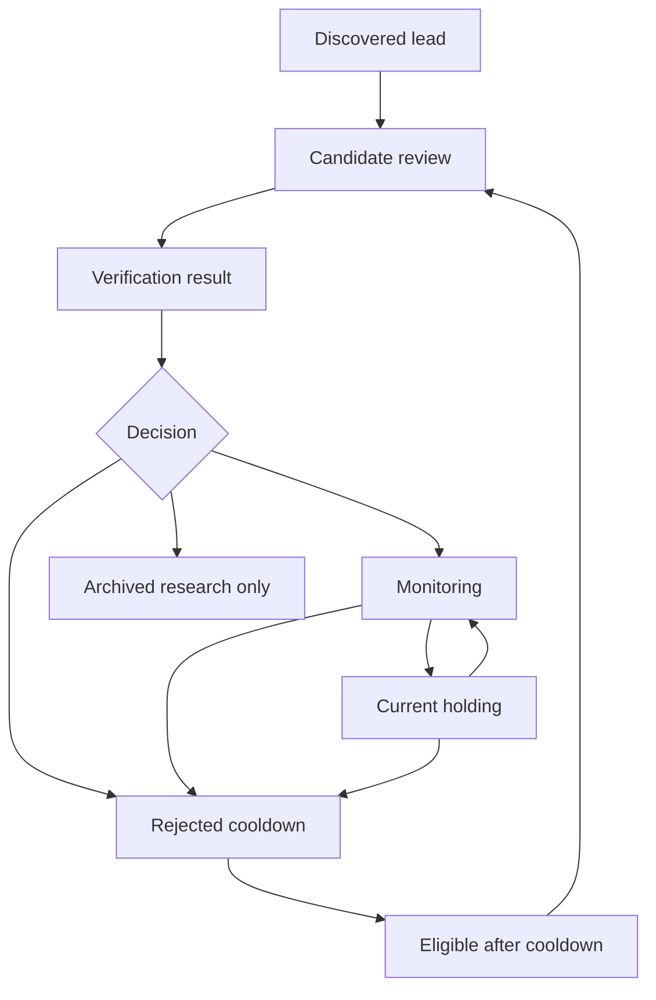

# Artifact Lifecycle And Hygiene

Last updated: 2026-05-24

## Goal

Keep the repo useful as research volume grows.

The system will eventually research many stocks, industries, and themes. Not every run artifact should stay in the active working surface forever. The goal is to keep active holdings, monitoring names, current priorities, and open decisions easy to find while preserving old research in an archive that Codex can still locate when needed.

## Core Principle

Do not delete useful research by default. Move it out of the active surface and index it.

Active truth should live in:

- `stock_tracking/current_holdings/`
- `stock_tracking/monitoring/`
- `stock_tracking/rejected/`
- `stock_tracking/stock_info_files/`
- `market_research/industries/`
- `market_research/themes/`
- `strategy/`
- `agents/human_review_digest.md`

Run artifacts under `agents/runs/` are evidence and audit history. They are useful, but they should not become the primary place to find current investment state.

Manual follow-up research reports under `agents/runs/{run_id}/` are evidence artifacts. They should not become a second memory system. Durable company facts, thesis changes, risks, and source-backed corrections must be promoted into the relevant company file, category state, market-research file, or strategy file. Operational lessons from the follow-up belong in `agents/memory/`; raw provider output and temporary reasoning notes stay in the run folder and can later be archived/indexed.

## Current Implementation

The hygiene layer is implemented as inventory, proposal, and archive-move commands:

```powershell
python -m stock_research knowledge-promotion status --run-id RUN_ID
python -m stock_research knowledge-promotion status --run-id RUN_ID --write
python -m stock_research artifact-hygiene inventory --write
python -m stock_research artifact-hygiene archive
python -m stock_research artifact-hygiene archive --write
python -m stock_research artifact-hygiene cleanup-json
python -m stock_research artifact-hygiene cleanup-json --write
```

Knowledge promotion is the cleanup gate. It checks whether a run's important information has landed in durable repo surfaces before generated JSON can be removed. It writes `agents/runs/{run_id}/knowledge_promotion_status.md` and `.json` when `--write` is passed.

Inventory scans markdown report artifacts under `agents/runs/` and `archive/runs/`, classifies them as `active_keep`, `recent_keep`, `review_blocked`, `archive_candidate`, or `archived`, and writes:

```text
archive/research_index.md
```

Archive moves are dry-run by default. With `--write`, only `archive_candidate` markdown artifacts are moved to:

```text
archive/runs/{year}/{run_id}/...
```

The command never moves active ticker artifacts, open human-review context, stock info files, or non-markdown raw/evidence files. It writes `archive/archive_move_report.md` and refreshes `archive/research_index.md`.

Runtime JSON cleanup is separate from markdown archive moves. `cleanup-json` deletes only generated `.json` files under `agents/runs/`, is dry-run by default, calls the knowledge-promotion gate for each run, and writes `archive/runtime_cleanup_report.md` only when `--write` is passed. It does not delete markdown reports, company files, strategy files, memory files, or review queues.

Default JSON retention is conservative:

- default retention is 30 days,
- optional `--retention-days N` can be used for a tighter local cleanup pass,
- optional `--run-id RUN_ID` limits the check to one or more explicit runs.

JSON cleanup blocks a run when any of these are true:

- the run is newer than the retention threshold,
- an open human-review item points into the run,
- required markdown/finalization artifacts are missing from both the active run folder and `archive/runs/` (`run_summary.md`, `quality_report.md`, `memory_reflection.md`, `finalization.md`),
- `memory_update_drafts.json` still has ready memory updates,
- a human synthesis pack exists without the canonical `*_final_human_report.md`,
- knowledge promotion is not cleanup-ready because company-file, category-state, operational-memory, human-review, or market-research promotion is incomplete,
- any run JSON file is tracked by Git or not ignored by Git.

Knowledge promotion checks:

- required run summary, quality, reflection, finalization, and final-report markdown can be in the active run folder or already moved to `archive/runs/`,
- active holding/monitoring ticker reports have deterministic company-file markers such as `AUTOFACT-{run_id}-{TICKER}` or `PROMOTED-{run_id}-{TICKER}`,
- relevant category state files contain `CATSTATE-{run_id}`,
- memory update drafts have no remaining `ready` items; applied drafts are marked `applied`,
- human-review rows that reference the run are resolved, completed, rejected, superseded, or applied,
- market-research artifacts are linked from HRQ, market research, strategy, or human-request files,
- archive index coverage is visible as a warning when missing.

Run finalization writes archive proposals into:

```text
agents/runs/{run_id}/archive_proposals.md
```

This tells the user/Codex what would be eligible for archive before any move command is run.

## Proposed Archive Structure

```text
archive/
  research_index.md
  company_research/
    active/
    archived/
  market_research/
    active/
    archived/
  runs/
    YYYY/
```

This structure can be added later. For now, the important part is to plan for it and avoid treating `agents/runs/` as the long-term knowledge index.

## Research Index

The durable index is:

```text
archive/research_index.md
```

The current index tracks:

- status: active_keep, recent_keep, review_blocked, archive_candidate, or archived
- run id
- artifact type
- ticker or topic
- age in days when the run id contains a date
- artifact path
- reason for the classification

This lets Codex answer: "Have we researched this before, and where is the material?"

## Company Lifecycle



Rules:

- Holdings and monitoring names stay in active stock tracking and should have detailed company files.
- Rejected names keep enough information to explain why they were rejected and when they can resurface.
- Old run reports for non-active names can move to archive after the key conclusion is captured in the rejected row/index.
- If a rejected stock resurfaces after cooldown, Codex should read the archived/indexed prior research before starting from scratch.

## Run Artifact Hygiene

Keep in Git or archive as markdown:

- final digests,
- opportunity assessments for active holdings/monitoring names,
- follow-up reports that are linked from active company files and still relevant to open questions,
- market reports tied to active priorities,
- candidate verification results,
- memory/reflection summaries,
- quality reports needed for debugging.

Archive or move from the active view:

- old raw run reports for candidates rejected or ignored,
- duplicate regenerated reports,
- stale candidate-review artifacts superseded by newer review groups,
- temporary debug artifacts after their lessons are captured in memory/backlog.

Clean up ignored local JSON/runtime artifacts after the run has been finalized and promoted:

- run-root machine outputs such as `manifest.json`, `run_summary.json`, `quality_report.json`, `finalization.json`, `orchestration_report.json`, `codex_supervised_review_pack.json`, and `final_digest.json`,
- raw provider JSON under `raw/`,
- provider-neutral evidence packet JSON under `evidence_packets/`,
- intermediate specialist, candidate-lead, and synthesis-pack JSON when matching markdown/final reports exist.

Do not convert raw provider dumps into `agents/memory/`. If a JSON artifact contains a durable lesson, promote that lesson into the right durable surface first:

- operational/source/workflow lesson: `agents/memory/`,
- durable project decision: `MEMORY.md`,
- investment fact or thesis update: company file, category state, market research, or strategy,
- open decision: `agents/human_review_queue.md` and `agents/human_review_digest.md`,
- prior research discoverability: `archive/research_index.md`.

## Git Commit Hygiene

Before committing after a run or cleanup pass:

- confirm no generated run JSON is tracked by Git,
- commit durable state changes in `stock_tracking/`, `market_research/`, `strategy/`, `MEMORY.md`, `agents/memory/`, docs, plans, and review queues,
- commit archive moves and `archive/research_index.md` when stale markdown was moved out of `agents/runs/`,
- commit only run markdown that is still needed as current evidence, such as active holding/monitoring reports, final human reports, quality/finalization trails, or artifacts linked from open or recently approved human-review rows,
- leave specialist-lane reports, synthesis packs, memory-writer prompts/reviews, and other intermediate markdown local/ignored unless they are explicitly needed for review or no final summary exists,
- do not stage ignored runtime JSON or raw provider dumps,
- if a run artifact is neither linked from durable state nor needed for review, promote the lesson/fact first and then let archive/cleanup handle the artifact instead of committing it as a new active file.

Useful checks:

```powershell
git ls-files agents/runs | Select-String '\.json$'
python -m stock_research artifact-hygiene inventory
python -m stock_research artifact-hygiene cleanup-json
```

## Automation Backlog

1. [x] Add `archive/research_index.md`.
2. [x] Add an artifact inventory command that lists active vs stale run artifacts.
3. [x] Add an archive command that moves old run markdown into `archive/` and updates the index.
4. [x] Add guardrails so archiving never removes active holding/monitoring company files.
5. [x] Add run-finalization logic that proposes archive candidates after reports are promoted into durable company/market/strategy files.
6. [x] Add dry-run-first runtime JSON cleanup with finalization, memory-draft, final-report, open-review, Git-ignore, and Git-tracking guardrails.
7. [x] Add run-level knowledge-promotion status and require it before runtime JSON cleanup.

## Guardrails

- Never archive current holding or monitoring company files.
- Never delete evidence by default; move and index.
- Never delete runtime JSON unless the cleanup command confirms knowledge promotion, finalization, memory, review, final-report, Git-ignore, and Git-tracking guardrails pass.
- Never archive an item with an open HRQ decision unless the HRQ row is superseded or resolved.
- Preserve rejected cooldown dates and reasons.
- Keep archive indexes concise so future Codex chats do not need to scan hundreds of old reports.
