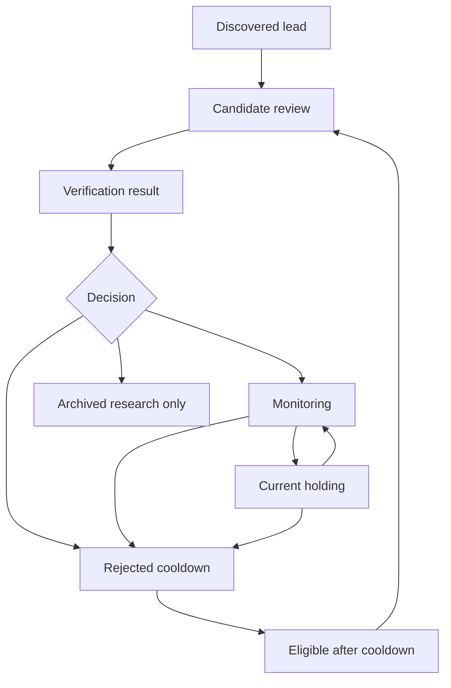

# Artifact Lifecycle And Hygiene

Last updated: 2026-05-17

## Goal

Keep the repo useful as research volume grows.

The system will eventually research many stocks, industries, and themes. Not every run artifact should stay in the active working surface forever. The goal is to keep active holdings, monitoring names, current priorities, and open decisions easy to find while preserving old research in an archive that Codex can still locate when needed.

## Core Principle

Do not delete useful research by default. Move it out of the active surface and index it.

Active truth should live in:

- `stock_tracking/current_holdings/`
- `stock_tracking/monitoring/`
- `stock_tracking/rejected/`
- `stock_tracking/stock_info_files/`
- `market_research/industries/`
- `market_research/themes/`
- `strategy/`
- `agents/human_review_digest.md`

Run artifacts under `agents/runs/` are evidence and audit history. They are useful, but they should not become the primary place to find current investment state.

Manual follow-up research reports under `agents/runs/{run_id}/` are evidence artifacts. They should not become a second memory system. Durable company facts, thesis changes, risks, and source-backed corrections must be promoted into the relevant company file, category state, market-research file, or strategy file. Operational lessons from the follow-up belong in `agents/memory/`; raw provider output and temporary reasoning notes stay in the run folder and can later be archived/indexed.

## Current Implementation

The hygiene layer is implemented as inventory, proposal, and archive-move commands:

```powershell
python -m stock_research artifact-hygiene inventory --write
python -m stock_research artifact-hygiene archive
python -m stock_research artifact-hygiene archive --write
```

Inventory scans markdown report artifacts under `agents/runs/` and `archive/runs/`, classifies them as `active_keep`, `recent_keep`, `review_blocked`, `archive_candidate`, or `archived`, and writes:

```text
archive/research_index.md
```

Archive moves are dry-run by default. With `--write`, only `archive_candidate` markdown artifacts are moved to:

```text
archive/runs/{year}/{run_id}/...
```

The command never moves active ticker artifacts, open human-review context, stock info files, or non-markdown raw/evidence files. It writes `archive/archive_move_report.md` and refreshes `archive/research_index.md`.

Run finalization writes archive proposals into:

```text
agents/runs/{run_id}/archive_proposals.md
```

This tells the user/Codex what would be eligible for archive before any move command is run.

## Proposed Archive Structure

```text
archive/
  research_index.md
  company_research/
    active/
    archived/
  market_research/
    active/
    archived/
  runs/
    YYYY/
```

This structure can be added later. For now, the important part is to plan for it and avoid treating `agents/runs/` as the long-term knowledge index.

## Research Index

The durable index is:

```text
archive/research_index.md
```

The current index tracks:

- status: active_keep, recent_keep, review_blocked, archive_candidate, or archived
- run id
- artifact type
- ticker or topic
- age in days when the run id contains a date
- artifact path
- reason for the classification

This lets Codex answer: "Have we researched this before, and where is the material?"

## Company Lifecycle



Rules:

- Holdings and monitoring names stay in active stock tracking and should have detailed company files.
- Rejected names keep enough information to explain why they were rejected and when they can resurface.
- Old run reports for non-active names can move to archive after the key conclusion is captured in the rejected row/index.
- If a rejected stock resurfaces after cooldown, Codex should read the archived/indexed prior research before starting from scratch.

## Run Artifact Hygiene

Keep:

- final digests,
- opportunity assessments for active holdings/monitoring names,
- follow-up reports that are linked from active company files and still relevant to open questions,
- market reports tied to active priorities,
- candidate verification results,
- memory/reflection summaries,
- quality reports needed for debugging.

Archive or compress from the active view:

- old raw run reports for candidates rejected or ignored,
- duplicate regenerated reports,
- stale candidate-review artifacts superseded by newer review groups,
- temporary debug artifacts after their lessons are captured in memory/backlog.

Ignored local JSON/raw/evidence artifacts should remain local runtime outputs unless they are explicitly needed for a reproducible test fixture.

## Automation Backlog

1. [x] Add `archive/research_index.md`.
2. [x] Add an artifact inventory command that lists active vs stale run artifacts.
3. [x] Add an archive command that moves old run markdown into `archive/` and updates the index.
4. [x] Add guardrails so archiving never removes active holding/monitoring company files.
5. [x] Add run-finalization logic that proposes archive candidates after reports are promoted into durable company/market/strategy files.

## Guardrails

- Never archive current holding or monitoring company files.
- Never delete evidence by default; move and index.
- Never archive an item with an open HRQ decision unless the HRQ row is superseded or resolved.
- Preserve rejected cooldown dates and reasons.
- Keep archive indexes concise so future Codex chats do not need to scan hundreds of old reports.
