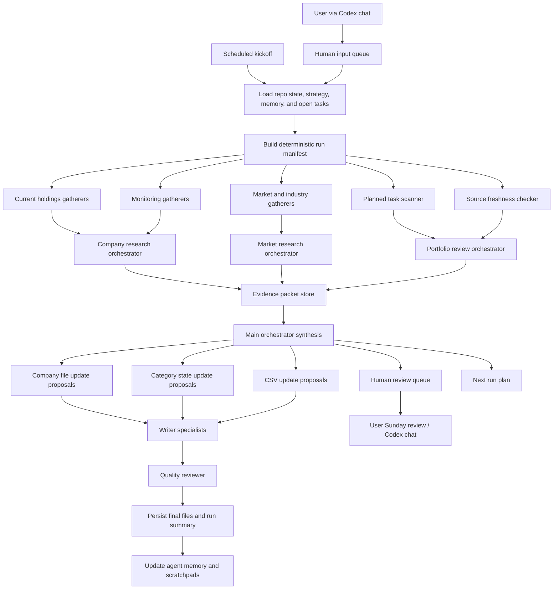

# Investment Agent Workflow Architecture

Last updated: 2026-05-03

## Goal

Build a Python-based stock tracking and investment research system that keeps repo files current, gathers new evidence on a schedule, and gives the user auditable research summaries and next-step suggestions.

This is research automation, not automatic trading. Buy, sell, and position-size decisions should stay human-approved.

Initial market scope: US and Europe.

Default recurring cadence: weekly deep research on Saturday, so Sunday can be used for review and planning.

Alert goals:

- tracked-stock change alerts for holdings and monitored names,
- new-stock discovery alerts for candidates that match the strategy.

Human interaction goal:

- Codex chat is the primary user interface.
- User ideas, requests, and strategy thoughts should be translated into durable repo state.
- Human input requests and system-generated approval items must stay in separate queues.

## Design Principles

- Deterministic first, agentic second.
- Separate gathering, analysis, synthesis, and writing.
- Keep all important claims traceable to a source URL, filing, API response, or internal artifact.
- Store durable state in files that humans can inspect.
- Keep short-term agent run state separate from long-term investment memory.
- Use specialist agents for narrow tasks and the orchestrator for judgment, routing, and prioritization.
- Prefer structured outputs between steps so downstream agents do not parse prose.

## Source-Informed Notes

- OpenAI Agents SDK supports agents with instructions, tools, handoffs, guardrails, and structured outputs: https://openai.github.io/openai-agents-python/agents/
- The SDK explicitly supports mixing LLM orchestration with code orchestration, and recommends parallel code orchestration when tasks do not depend on each other: https://openai.github.io/openai-agents-python/multi_agent/
- Tool guardrails should be used around custom tools in manager/handoff workflows because agent-level guardrails only run at workflow boundaries: https://openai.github.io/openai-agents-python/guardrails/
- SDK tracing captures LLM calls, tool calls, handoffs, guardrails, and custom events, which is useful for learning from failed runs: https://openai.github.io/openai-agents-python/tracing/
- SEC EDGAR provides unauthenticated JSON APIs for submissions and XBRL financial statement data, updated during the day as filings are disseminated: https://www.sec.gov/search-filings/edgar-application-programming-interfaces
- Finance-agent research commonly separates data analysis, investment research, trading, investment management, and risk management tasks, which maps well to specialist roles: https://aclanthology.org/2025.findings-emnlp.972.pdf
- OpenBB can be useful as a Python data access layer across multiple providers, but should be evaluated before becoming a dependency: https://openbb.co/products/odp
- Twelve Data covers broad global instruments and may be useful for US/Europe coverage comparison: https://twelvedata.com/docs
- ECB and Eurostat APIs are useful for European macro context: https://data.ecb.europa.eu/help/api/data and https://ec.europa.eu/eurostat/web/user-guides/data-browser/api-data-access/api-introduction
- ESMA's European Single Access Point is relevant for future EU filings coverage, but public availability is phased: information collection starts July 2026 and public access is planned for July 2027: https://www.esma.europa.eu/fi/node/223341

## Repository State Model

```text
stock_tracking/
  current_holdings/
    current_holdings.csv
    current_holdings_state.md
  monitoring/
    monitoring.csv
    monitoring_state.md
  rejected/
    rejected.csv
    rejected_state.md
  stock_info_files/
    current_holdings/
      TICKER_company_name.md
    monitoring/
      TICKER_company_name.md
    rejected/
      TICKER_company_name.md

market_research/
  industries/
  themes/
  macro/
  discovery/

strategy/
  investment_strategy.md
  screening_criteria.md
  risk_rules.md

agents/
  orchestrator/
  specialists/
  memory/
  runs/

docs/
  templates/
    company_stock_info_template.md
    category_state_template.md
    stock_tracking_csv_schema.md
  descriptions/
    human_interaction_workflow.md
    repo_map.md
  plans/
    human_research_requests.md
```

The `agents/memory/` and `agents/runs/` folders are proposed additions for implementation.

The stock tracking templates and starter files were created on 2026-04-30.

The human interaction intake layer was added on 2026-05-03.

## Human Interaction Layer

The user should normally interact with this repo through Codex chat, not by manually editing files.

Normal flow:

1. User gives Codex a natural-language request.
2. Codex reads repo context using `docs/descriptions/repo_map.md`.
3. Codex classifies the request.
4. Codex updates the correct durable file.
5. Codex records the request in `docs/plans/human_research_requests.md`.
6. Codex either queues it for the Saturday workflow, performs immediate manual research when asked, or asks for clarification if routing is unsafe.

There are two separate human-facing queues:

- Human input queue: `docs/plans/human_research_requests.md`
  - Things the user wants the system to consider.
  - Examples: research four stocks, look into an industry, track a technology theme.
- Human review queue: `agents/human_review_queue.md`
  - Things the system wants the user to approve.
  - Examples: stock status moves, cooldown overrides, strategy changes, buy/sell/position-size recommendations.

Request routing:

- Specific stock research goes to `stock_tracking/monitoring/` by default unless the user says it is held or rejected.
- Industry requests go to `market_research/industries/`.
- Theme or technology requests go to `market_research/themes/`.
- Recurring priorities go to `strategy/research_priorities.md`.
- Strategy changes go to `strategy/investment_strategy.md`, `strategy/screening_criteria.md`, or `strategy/risk_rules.md`.
- Approval items go to `agents/human_review_queue.md`.

## Stock File Template

Each detailed company file should contain:

- Company snapshot: ticker, name, exchange, sector, industry, market cap band, source date.
- Current status: holding, monitoring, rejected, or pending review.
- Status dates: date found, date last updated, date rejected if applicable, next eligible review date if rejected.
- Thesis: why we care, what must be true, what would change our mind.
- Filings: latest 10-K, 10-Q, 8-K, 20-F/6-K where relevant, with source links and key notes.
- Financials: revenue growth, margins, cash, debt, free cash flow, valuation, major changes.
- Developments: product, management, regulatory, legal, customer, industry, macro.
- Sentiment: X.com/community, news tone, analyst tone if available, with noise caveats.
- Risks and red flags: accounting, dilution, customer concentration, competition, cyclicality, governance.
- Open questions: what needs more research.
- Next actions: concrete tasks and owner/agent type.
- Change log: date, agent/user, summary, sources.

## Category State Files

Each category-level markdown file should answer:

- What do we currently think about this bucket?
- Which companies need urgent review?
- Which industries or macro events affect this bucket?
- Which planned tasks are open?
- What changed since the last run?
- What risks or stale assumptions should the next run revisit?

## Recommended Agent Layers

### Layer 0: Scheduled runner

Responsible for kickoff only:

- Resolve schedule and run mode.
- Load repo index and prior run state.
- Build the deterministic task list.
- Start independent gatherers in parallel.
- Persist raw run artifacts.

### Layer 1: Deterministic gatherers

These are code-driven steps, not open-ended reasoning:

- Repo state loader.
- Task and stale-data scanner.
- Current holdings company list loader.
- Monitoring company list loader.
- Rejected company review scanner.
- Strategy and criteria loader.
- Human research request loader.
- Research priorities loader.
- Human review queue loader.
- Source freshness checker.
- Filing availability checker.
- Market calendar and earnings calendar checker.
- Rejected-stock cooldown checker.

### Layer 2: Specialist research agents

These agents return structured evidence packets:

- Company news search specialist: latest company news, source credibility, direct impact.
- Company financial data specialist: prices, valuation, key metrics, historical comparisons.
- SEC filing specialist: new filings, material changes, risk-factor changes, source excerpts.
- Earnings/transcript specialist: earnings call notes, guidance, management tone, Q&A issues.
- X.com stock sentiment specialist: latest ticker/company discussion, recurring claims, hype level, skepticism, accounts to verify.
- X.com industry sentiment specialist: industry mood, emerging tickers, narratives, possible bubbles.
- Exa industry research specialist: industry news, technology shifts, regulation, competitors, macro dependencies.
- Discovery specialist: new candidate stocks from industries, filings, news, and community chatter.
- Alert specialist: converts evidence into tracked-stock change alerts and new-candidate discovery alerts.
- Risk and contradiction specialist: checks whether new evidence conflicts with the current thesis.

### Layer 3: Sub-orchestrators

Use sub-orchestrators where there is enough complexity to coordinate several specialists:

- Market research orchestrator: coordinates industry, macro, theme, and discovery research.
- Company research orchestrator: coordinates filings, financials, news, sentiment, and company-file update proposals for one ticker.
- Portfolio review orchestrator: coordinates impact across current holdings, monitoring, and rejected buckets.
- Memory and evaluation orchestrator: reviews traces/run logs, extracts lessons, updates agent memory.

### Layer 4: Main orchestrator

The main orchestrator receives structured packets from deterministic steps and sub-orchestrators. It decides:

- which company files need updates,
- which category state files need updates,
- whether a stock moves between monitoring/current/rejected,
- whether a rejected stock is still inside its 6-week cooldown,
- which issues need human confirmation,
- which deeper specialist tasks to launch,
- what next scheduled run should focus on.

The orchestrator should call specialists as tools for bounded tasks. Use handoffs only when a specialist should own the next interaction directly.

### Layer 5: Writers and quality control

Keep file writing separate from research:

- Company file updater: surgically updates one company markdown file.
- Category state updater: updates holdings/monitoring/rejected state files.
- CSV updater: validates schema and updates overview rows.
- Strategy impact updater: proposes strategy changes, but should require human approval for major changes.
- Quality reviewer: checks citations, stale data, contradictions, malformed CSV, and overconfident claims.

## Proposed Flow



## Parallelization Plan

Run in parallel:

- Per-company latest news checks.
- Per-company SEC filing checks.
- X.com sentiment checks by ticker.
- Industry sentiment/news checks.
- Market/macro checks.
- Stale-file scans.
- Candidate discovery scans across strategy-relevant industries.

Run sequentially:

- Repo state load before research routing.
- Human input queue and research priorities load before run manifest generation.
- Raw evidence capture before synthesis.
- Synthesis before file updates.
- File updates before quality review.
- Quality review before memory updates.

## Memory Design

### Durable project memory

Use `MEMORY.md` only for durable repo decisions:

- selected SDK/framework,
- approved workflow architecture,
- approved data providers,
- irreversible conventions,
- high-impact strategy decisions.

### Scratchpads

Use `docs/scratchpads/` for topic memory:

- `agent_orchestration_scratchpad.md`: agent architecture, lessons, open questions.
- `market_research_scratchpad.md`: research-source quality, industries, recurring themes.
- `stock_tracking_scratchpad.md`: file conventions, CSV schema, category state.
- `strategy_scratchpad.md`: user preferences, evolving thesis rules.

### Agent run memory

Proposed implementation folder: `agents/memory/`.

Suggested files:

- `orchestrator_lessons.md`: what worked, what failed, bad routing decisions, prompt/tool improvements.
- `source_quality.md`: which sources were useful, noisy, stale, paywalled, or unreliable.
- `specialist_playbooks.md`: best prompts and rules for each specialist area.
- `evaluation_metrics.md`: run-level metrics and recurring failure patterns.

### Run artifacts

Proposed implementation folder: `agents/runs/YYYY-MM-DD_run-id/`.

Store:

- `manifest.json`: tickers, industries, tasks, tools enabled, schedule mode.
- `evidence_packets/*.json`: structured specialist outputs.
- `run_summary.md`: final synthesis and updates made.
- `quality_report.md`: citation and consistency checks.
- `trace_links.md`: OpenAI trace IDs or local trace references.

## Evidence Packet Schema

Every specialist should return a structured packet with:

- `subject_type`: company, industry, macro, strategy, portfolio.
- `subject_id`: ticker, industry name, or internal topic ID.
- `time_window`.
- `sources`: URL, title, publisher, date, accessed_at, source_type.
- `claims`: claim, evidence, source_ids, confidence, impact, novelty.
- `risks`: risk, evidence, severity, time_horizon.
- `contradictions`: current_repo_claim, new_evidence, suggested_action.
- `recommended_updates`: target_file, update_type, summary, needs_human_review.
- `unknowns`: concrete missing facts or source gaps.

## Tooling Proposal

Initial Python implementation:

- OpenAI Agents SDK for orchestrator and specialists. Status 2026-05-03: still a candidate, not locked; compare against Pydantic AI and LangGraph before Priority 4 agent implementation.
- Pydantic for evidence packet schemas.
- Pandas or Python CSV module for overview CSV validation.
- Approved initial providers: Exa, X.com, SEC, yfinance, FMP, Polygon, and Alpha Vantage.
- SEC EDGAR official APIs for US filings and XBRL data.
- Exa API for web/company/industry research.
- X.com API or approved provider approach for social sentiment.
- yfinance for first-pass price/ratio prototyping, cross-checked against paid providers where available.
- FMP, Polygon, and Alpha Vantage for market data, fundamentals, and cross-provider validation.
- Candidate providers to evaluate: OpenBB as a unified Python access layer; Twelve Data or EODHD for broader global price/fundamental coverage; Finnhub for news/earnings/calendar coverage; Nasdaq Data Link for premium and economic datasets; FRED, ECB, and Eurostat for macro context; Companies House for UK company filings; ESMA ESAP later when public access is available.
- Optional vector store later for filing retrieval, after file formats stabilize.

## Guardrails

- Tool output must preserve source metadata.
- File writers can only edit their assigned target files.
- Major strategy changes and buy/sell/reject moves require human approval.
- Rejected stocks cannot be promoted back to monitoring until 6 weeks have passed, unless the user explicitly overrides the cooldown.
- Any result based mainly on social sentiment must be labeled as sentiment, not fact.
- If sources conflict, the system should preserve the conflict instead of hiding it.
- Do not let agents fabricate missing financial metrics; mark them unknown.
- Do not store API keys or broker/account data in repo files.

## Resolved Decisions

- Initial scope: US and Europe.
- Output goals: tracked-stock change alerts and new-stock discovery alerts.
- Approved initial providers: Exa, X.com, SEC, yfinance, FMP, Polygon, Alpha Vantage.
- Cadence: weekly deep research on Saturday.
- Rejected-stock cooldown: 6 weeks before resurfacing as a candidate.

## Open Questions

- What is the preferred valuation style: growth/quality, deep value, momentum, event-driven, thematic, or mixed?
- How should confidence be represented: numeric score, low/medium/high, or evidence-grade rubric?
- How much autonomy may file writers have before requiring human review?
- Which European markets should be prioritized first: UK, Germany, France, Netherlands, Nordics, Switzerland, or all major European exchanges?
- Which provider should be treated as source of truth when market data conflicts?
