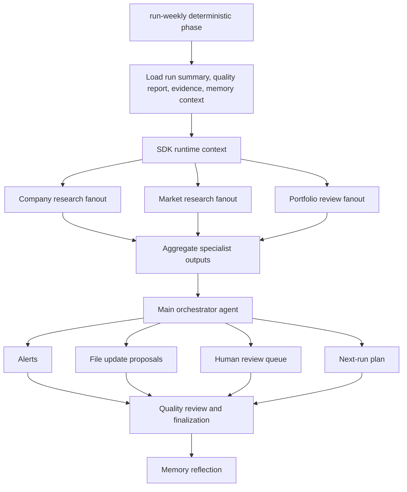

# OpenAI Agents SDK Orchestration Backlog

Last updated: 2026-05-15

## Goal and Scope

Build the LLM orchestration layer for the stock research repo using OpenAI Agents SDK.

This backlog covers runtime architecture, composability, tracing, guardrails, memory injection, specialist-as-tool behavior, parallel execution, and integration with the existing deterministic weekly runner.

Out of scope for the first slice:

- replacing deterministic provider/analysis code,
- vector databases,
- automatic trading or broker actions.

## Confirmed Decision

- Use OpenAI Agents SDK as the agent framework.
- Keep deterministic kickoff and run finalization in Python code.
- Add the SDK runtime after deterministic provider tasks, analysis tasks, run summary, quality report, and memory context loading.
- Store durable truth in repo artifacts, not SDK sessions.

## Architecture Principles

- Deterministic first: code builds the manifest, runs providers, runs deterministic analysis, and validates outputs before LLM synthesis.
- Function first: reusable behavior belongs in importable Python functions. Deterministic workflows and SDK tools should call those functions directly; CLI commands are thin manual/scheduler/debug wrappers only.
- Composable agents: every specialist should be callable directly by code and callable by an orchestrator as a tool.
- Structured outputs: every orchestrator/specialist output should use a typed schema that can be validated and written as an artifact.
- Proposal-first writes: agents should propose file changes unless a narrow writer tool has explicit permission and validation.
- Local auditability: OpenAI traces help debug, but repo-local run metrics, trace links, summaries, and review queues remain required.
- Memory-aware prompts: every specialist prompt should receive task-relevant operational memory from `memory prompt-context`.
- Guard critical tools: provider tools, file tools, memory tools, and writer tools need input/output guardrails.

## Priority 0: Documentation and Decision Capture

- [x] Review latest official OpenAI Agents SDK docs.
- [x] Record SDK selection in `MEMORY.md`.
- [x] Create dedicated SDK orchestration scratchpad.
- [x] Create this dedicated SDK orchestration backlog.
- [x] Link this backlog from repo map, main backlog, workflow plan, and architecture docs.
- [x] Add an SDK runtime description file before implementation.
  - Output: `docs/descriptions/openai_agents_sdk_orchestration.md`.

## Priority 1: Minimal SDK Runtime Spike

- [x] Add the `openai-agents` dependency.
  - Call out dependency change in `SETUP.md` and README.
- [x] Create `stock_research/agent_runtime/` package.
- [x] Define `ResearchRunContext`.
  - Fields: repo root, run id, manifest path, memory context, allowed write targets, trace id, group id, run mode, dry-run flags.
- [x] Define initial structured outputs.
  - Candidate schemas: `SpecialistResult`, `OrchestratorDecision`, `AlertProposal`, `FileUpdateProposal`, `HumanReviewItem`.
- [x] Build a minimal manager agent plus one specialist agent-as-tool.
  - Preferred first specialist: synthesis over existing company-news or financial review artifacts, not a new provider.
- [x] Run a live or mocked smoke test.
  - Must write local run metrics and trace link artifacts.

## Priority 2: Tool Wrappers Around Existing Deterministic Code

- [x] Formalize core function vs CLI vs SDK tool boundary.
  - Rule: implement Python function first, wrap it as SDK tool when useful, add CLI only for scheduler/manual/debug/approval boundaries.
- [x] Wrap repo/memory inspection as function tools.
  - `load_repo_map`
  - `load_run_summary`
  - `load_quality_report`
  - `load_memory_prompt_context`
  - `list_evidence_packets`
  - `load_evidence_packet`
- [x] Start repo/memory inspection function tools.
  - Implemented: `load_run_markdown`, `list_run_markdown_artifacts`, `load_operational_memory`, `load_stock_tracking_csv`.
  - Extended: `load_repo_map`, `load_run_summary`, `load_quality_report`, `load_memory_prompt_context`, `list_evidence_packets`.
- [x] Wrap deterministic provider task execution as guarded tools.
  - Default to dry-run unless the runtime has explicit execute permission.
- [x] Wrap deterministic analysis task execution as guarded tools.
- [x] Wrap human review queue writing as a controlled tool.
  - Implemented as deterministic `agent-runtime queue-proposals --write --queue-review`, not as free-form LLM writes.
- [x] Wrap file update proposal creation as a controlled tool.
  - Implemented as `agents/runs/{run_id}/orchestrator_update_proposals.md` generated from saved SDK output after validation.
- [ ] Add tests for tool schemas and guardrails.
  - [x] Implemented for proposal bridge and approved proposal writer guardrails.
  - [x] Implemented for provider and analysis SDK function tools.
  - [ ] Still needed for memory and future writer SDK function tools.

## Priority 3: Observability and Tracking

- [x] Add OpenAI Agents SDK tracing configuration.
  - Use workflow name, trace id, group id, trace metadata, and sensitive-data settings.
- [x] Add local run hooks.
  - Capture agent start/end, tool calls, LLM calls, errors, durations, and usage.
  - Current coverage: SDK hook rows for agent lifecycle, tool calls, LLM calls/usage when available, injected memory ids, final-output reported memory ids, and runner-level timeout/error status.
- [x] Write local observability artifacts.
  - `agents/runs/{run_id}/trace_links.md`
  - `agents/runs/{run_id}/run_metrics.md`
  - optional ignored JSON metrics for machine inspection.
- [x] Add timeout/error policy.
  - Implemented for live SDK runner and scheduled orchestrator calls. Timeouts/errors return blocked reviewable artifacts, write `run_metrics.md`, and do not silently fail the run.
  - Still pending for future code-level parallel specialist fanout: per-specialist retry settings and partial-result aggregation.
- [x] Feed observability output into memory reflection.
  - `memory_reflection.py` now reads `run_metrics.md`, counts SDK rows/tool/LLM calls, tracks injected/reported memory ids, and surfaces SDK timeouts/errors/missing metrics as reflection issues.

## Priority 4: Memory Injection

- [x] Create a runtime memory loader that calls existing memory code directly.
- [x] Inject task-relevant memory into every specialist prompt.
  - Current coverage: main orchestrator and company-news specialist.
- [x] Inject only high-signal memory, not every memory file.
  - Current behavior: `memory_item_ids` are task-relevant; `known_memory_item_ids` are retained only for validation.
- [x] Record which memory item ids were injected and reported in runtime artifacts.
  - `run_metrics.md` now records `memory_context:*` rows for injected ids and `memory_output:*` rows for ids reported by final structured output.
  - Remaining evaluation gap: judge whether reported ids were genuinely used correctly, not merely listed.
- [x] Ensure memory writer proposals continue to go through deterministic validation and `memory apply-updates`.
  - Current guardrail coverage confirms the main SDK orchestrator exposes read/plan tools but no direct memory-apply, memory-writer-apply, or company-file writer tool.

## Priority 5: Parallel Orchestration

- [x] Implement code-level fanout with `asyncio.gather`.
  - Parallel by ticker when independent.
  - Parallel by specialist when inputs do not depend on each other.
  - Current implementation: `stock_research/agent_runtime/fanout.py` runs independent SDK agent tasks concurrently with task-specific memory, per-task timeout, partial failure preservation, and aggregate metrics.
- [x] Implement dependency groups.
  - Example: provider evidence before synthesis; Exa contents before company-news ready state; financial_compare before financial synthesis.
  - Current implementation: first company-research packet groups one-ticker evidence into lanes and records missing lane prerequisites.
- [x] Add aggregation step.
  - Merge specialist outputs into a structured orchestrator input packet.
  - Current implementation: `build_company_research_packet(...)` aggregates evidence/report/manifest state and `aggregate_company_research(...)` merges fanout outputs into an `OrchestratorDecision`.
- [x] Add partial-failure behavior.
  - Current fanout helper preserves complete/error/timeout item results and returns overall `partial` status when any specialist fails.
  - Current scheduled implementation writes per-ticker company-research fanout artifacts and marks the weekly run `needs_review` if any company-research lane returns error/timeout/partial.
  - Still pending: richer main-orchestrator aggregation over partial specialist failures.

## Priority 6: Main and Sub-Orchestrators

- [x] Build company research sub-orchestrator.
  - Coordinates filings, news, financials, sentiment, risks, and update proposals for one ticker.
  - Current implementation: `company_research_orchestrator` is registered, exposed to the main orchestrator, has prompt/spec artifacts, can build a one-ticker company research packet, can run financial, company-news, Exa company-search, SEC filing, xAI/Grok sentiment, risk/thesis, opportunity-assessment, writer, and quality-review fanout, and writes per-ticker scheduled artifacts.
- [x] Add opportunity-assessment specialist lane.
  - Current implementation: deterministic `opportunity_assessment` analysis task plus SDK `opportunity_assessment_specialist` synthesize financials, Exa news/company search, SEC filings, Grok/X sentiment, and risk signals into a concise research opinion for human review.
  - Validation: AMZN weekly-style run wrote `agents/runs/2026-05-16_weekly/reports/opportunity_assessment/AMZN_opportunity_assessment.md`.
- [x] Add final weekly-style digest artifact.
  - Current implementation: `stock_research/weekly_digest.py` writes `agents/runs/{run_id}/final_digest.md/json` with per-ticker opportunity view, financial facts, news/trends/sentiment, filing coverage, watch items, and next actions.
  - Current quality gates: digest validation requires existing opportunity, financial-review, and company-news evidence links; flags direct trade language; flags Grok/X labels that are not explicitly social signals; writes digest quality findings when gates fail.
  - Validation: AMZN/AAPL weekly-style run wrote `agents/runs/2026-05-16_weekly/final_digest.md`; deterministic digest status is `ready` with no digest quality findings.
- [x] Build market research sub-orchestrator.
  - Coordinates industry/theme research, discovery, candidate validation, and strategy fit.
  - Current progress: first SDK version registered as `market_research_orchestrator`; it builds an industry/theme packet and runs Exa industry, Grok/X discovery, candidate discovery, and quality-review fanout. Manual market research is now available through `python -m stock_research market-research run --topic TOPIC --subject-type industry|theme --write [--execute-providers] [--execute-orchestrator]`. The manual path writes a market report, candidate lead schema, and discovery quality gates. Grok/X is a required discovery lane for niche trends, hype, rumors, sentiment, and emerging ticker leads; promotion still requires Exa/filing/market-data verification.
- [x] Complete the first manual discovery-to-monitoring lifecycle.
  - Discover: Exa and Grok/X surface companies, tickers, narratives, hype, rumors, and sentiment.
  - Normalize: resolve company names, tickers, exchanges, countries, duplicate listings, and share classes.
  - Gate: enforce source ids, Grok-only verification limits, rumor labels, strategy fit, and rejected-stock cooldown.
  - Human review: queue verification, ignore, cooldown override, or possible-monitoring decisions.
  - Verify: run company-research fanout for approved candidates before any monitoring promotion.
  - Promote: after approval and verification, add the candidate to monitoring, create a company file, and schedule future tracking.
  - Current status: manual discover/gate/review exists; normalization is partial through candidate grouping; approved-candidate verification manifest creation exists through `market-research candidate-followup`; consolidated verification result reporting exists through `market-research candidate-verification-result`; approval-gated promotion exists through `market-research candidate-promote` and blocks unless the HRQ row is approved, the decision is `monitoring_candidate`, and required verification reports exist.
- [x] Build portfolio review sub-orchestrator.
  - Synthesizes current holdings, monitoring, rejected cooldowns, bucket-level changes, and alerts.
  - Current implementation: `portfolio_review_orchestrator` is registered, exposed to the main orchestrator, and can build/write portfolio review packets from stock buckets, human-review queue state, and candidate verification result reports without applying writes.
- [x] Define digest-first human review operating model.
  - Current implementation: `docs/descriptions/human_review_operating_model.md` defines the digest as the user-facing inbox, the queue as durable state, portfolio/memory reports as drill-down context, async waiting behavior, and notification/email boundaries.
- [x] Build memory/evaluation sub-orchestrator.
  - Reviews traces, metrics, quality reports, user corrections, and reflection proposals.
  - Current implementation: `memory_evaluation_orchestrator` is registered, exposed to the main orchestrator, builds/writes memory evaluation packets from run metrics, quality reports, reflection, recurring failures, memory drafts, writer review, and finalization, and does not apply memory updates.
- [x] Build main orchestrator aggregation layer.
  - Owns final synthesis, priorities, review queue items, update proposals, and next-run plan.
  - Current implementation: main orchestrator exists and now receives a structured aggregation packet listing company, market, portfolio, memory/evaluation, candidate verification, human-review digest, and review-count artifacts before final synthesis.

## Priority 7: Guardrails and Approval Gates

- [ ] Add tool guardrails for secrets, source metadata, and write scopes.
- [ ] Add output guardrails for citation requirements and overconfident claims.
  - Current progress: weekly final digest and opportunity assessments now have deterministic validators for required evidence links/source ids, Grok/X social-signal labeling, direct trade language, and taxonomy-only financial conflicts.
  - Still pending: broader malformed specialist output and missing-citation failure tests across all specialist lanes.
  - Product-quality gap from AMZN review: structural gates passed while the report was still not useful. Add usefulness gates for investor-facing reports: no status-label-only sentiment, no source-count-only news sections, no generic source titles as developments, no internal workflow chores as human watch items, and no final digest without concrete X/community narratives and bullish/bearish arguments.
  - 2026-05-12 repair pass: opportunity/final digest synthesis now preserves raw Grok/X narratives, bull/bear claims, accounts/posts, hype/noise, investor implications, and concrete news developments. This is a repair baseline, not the final target; the required bar is materially above the user's old standalone Grok PDF reports.
  - 2026-05-12 richer report pass: opportunity reports now include a dedicated investor insight section with company/industry context, trend/thesis change, X community split, non-obvious insights, valuation/analyst target snapshot, peer context, decision table, and research questions.
  - 2026-05-12 market report pass: manual market-research reports now include investor insight sections for industry/theme context, X/community pulse, trend evolution, candidate pipeline, non-obvious/contrarian angles, decision table, and explicit human decision choices.
  - 2026-05-12 fresh live pass: live Grok/X + Exa market research for `AI semiconductor supply chain and advanced packaging` now preserves the full raw Grok sections in the human report: X pulse, trend evolution, bull/bear narratives, candidate follow-up, investor scorecard, hype/noise/rumors, and verification tasks. Long provider packet filenames are compacted to avoid Windows path failures.
  - 2026-05-13 report cleanup pass: five human-facing review artifacts were tightened after user feedback. The report formatters now avoid visible `...`/`[...]` truncation, market reports no longer mix duplicate audit sections into the main storyline, opportunity reports no longer duplicate financial/news/Grok sections, market source ids are clickable, candidate review has a clear purpose/how-to-use section, and the HRQ digest explains category semantics and what approval does.
  - 2026-05-13 second report-quality pass: market reports now rank current/material context above stale background, remove inline Grok citation markers from prose, expand X/community pulse extraction, clarify Grok/X raw scorecard vs normalized candidate pipeline, and use a decision table instead of a wall of text. HRQ digest rows link evidence and hide raw source-id walls. Opportunity/weekly reports now extract strategic AI ecosystem items such as Anthropic, Claude, Bedrock, Trainium, OpenAI, NVIDIA, and Cerebras as explicit tailwinds/non-obvious angles when evidence-backed.
- [x] Add first deterministic output quality gates.
  - Implemented checks: summary/status shape, direct trade wording, valid memory item ids, existing file targets, source-backed update proposals, and existing source artifact paths.
- [ ] Keep buy/sell/position-size recommendations as human review items.
- [ ] Keep stock moves and major strategy changes behind human review unless explicitly approved.
- [ ] Improve company-file update UX.
  - Target behavior: low-risk factual/source-backed company-file updates should be auto-applied by a scoped deterministic writer and summarized at run end, while thesis changes, opinion changes, stock moves, and strategy changes remain approval-gated in HRQ.
- [x] Enforce rejected-stock cooldown before candidate promotion.
  - Current progress: manual market-research candidate gates mark active rejected cooldowns and prevent those leads from being promoted.

## Priority 8: Scheduler and Manual Runs

- [x] Add optional `run-weekly --execute-orchestrator`.
  - Current command: `python -m stock_research run-weekly --write --execute-orchestrator`.
  - Freshness behavior: actionable SDK output from dry-run provider/analysis inputs is marked `needs_review`.
- [x] Wire company-research fanout into scheduled weekly runs.
  - Current behavior: `run-weekly --write --execute-orchestrator` runs per-ticker company research for all current-holding and monitoring tickers before the main orchestrator and writes `agents/runs/{run_id}/company_research/{TICKER}_company_research.md`.
- [x] Add manual run command for user-triggered SDK orchestration over selected tickers/topics.
  - Current command: `python -m stock_research agent-runtime run --run-id RUN_ID --execute --write`.
- [x] Add clean manual market-research run path for industry/theme discovery.
  - Current command: `python -m stock_research market-research run --topic "robotics suppliers in Europe" --subject-type industry --write [--execute-providers] [--execute-orchestrator]`.
  - Current behavior: creates a manual manifest with Exa context, Exa company discovery, and Grok/X discovery lanes; writes a richer investor-facing report with industry/theme context, X/community pulse, trend evolution, candidate leads, verified/unverified status, hype/rumor labels, cooldown checks, decision choices, and next research tasks.
  - Live validation: `robotics suppliers in Europe`, `grid scale energy storage`, and `AI semiconductor supply chain and advanced packaging` provider runs completed. The semiconductor supply-chain run surfaced Amkor, LPKF/LPK, MKSI/ENTG, ONTO/CAMT, SK Hynix EMIB, and related verification tasks from Grok/X plus Exa. The energy-storage SDK market fanout completed after adding direct JSON evidence packet loading for specialists.
- [x] Add manual candidate-review bridge for discovery candidates.
  - Current command: `python -m stock_research market-research candidate-review --run-id RUN_ID --write --queue-review`.
  - Current behavior: reads manual market-research candidate-lead JSON, groups duplicate/share-class leads, writes `market_research/candidate_review.md`, and appends duplicate-safe human-review queue rows for verification, cooldown override, or possible monitoring decisions. It does not add stocks to monitoring.
- [x] Add approved-candidate verification follow-up bridge.
  - Current command: `python -m stock_research market-research candidate-followup --run-id RUN_ID --review-id HRQ-0004 --write`.
  - Current behavior: reads approved candidate-review HRQ rows, writes `candidate_verification_manifest.json` and `candidate_verification_plan.md`, and uses existing provider/analysis task shapes so the current runners can execute verification. It does not add stocks to monitoring.
- [x] Add consolidated candidate verification result report.
  - Current command: `python -m stock_research market-research candidate-verification-result --run-id RUN_ID --review-id HRQ-0004 --write`.
  - Current behavior: reads approved candidate-review rows, verification manifests, provider packets, and specialist reports; writes `candidate_verification_result.md/json`; and marks missing provider evidence or specialist `needs_human_review` statuses before any promotion attempt.
- [x] Add approval-gated candidate promotion writer.
  - Current command: `python -m stock_research market-research candidate-promote --run-id RUN_ID --review-id HRQ-0004 --write`.
  - Current behavior: validates the HRQ row is approved, the candidate-review group is a `monitoring_candidate`, a single ticker is selected, rejected/duplicate status is clear, and required verification artifacts exist before adding a monitoring CSV row and company file.
- [x] Add open human-review digest for manual runs.
  - Target behavior: summarize open HRQ items by decision type and priority, including HRQ id, candidate/ticker when available, current verification status, recommended next action, and evidence link.
  - Reason: the user should get a concise review surface instead of reading the full human review queue table after every run.
  - Current command: `python -m stock_research human-review digest --write`.
  - Current output: `agents/human_review_digest.md`.
- [x] Add deterministic human-review decision updater.
  - Target behavior: let Codex translate explicit user decisions into durable HRQ status updates before approved follow-up or writer commands run.
  - Current command: `python -m stock_research human-review decide --set HRQ-0004=approved --note "Run verification." --write`.
  - Current behavior: updates queue statuses/notes, refreshes `agents/human_review_digest.md`, and intentionally does not run verification, promotion, proposal application, or stock-file writes by itself.
- [ ] Add Codex/app notification automation for review items.
  - Target behavior: after weekly/manual research, summarize new or high-priority open review items and notify the user by Codex/app notification and/or email when there are findings to review.
  - Rule: notification should summarize `agents/human_review_digest.md`; it should not directly approve, reject, promote, or write files.
  - Future option: evaluate Gmail reply ingestion only after notification quality is stable and only with strict parsing, duplicate protection, and deterministic `human-review decide` writes.
  - Timing: defer until the digest is concise and stable enough to avoid noisy notifications.
- [x] Add run-end review digest summary to manual and weekly flows.
  - Target behavior: after any manual/weekly run, refresh or summarize `agents/human_review_digest.md`, mention new high-priority items, and state allowed decisions.
  - Reason: review items should be visible at the end of the run without requiring the user to open the raw queue manually.
  - Current progress: weekly `run-weekly --write` refreshes `agents/human_review_digest.md`, includes it as a workflow step, writes it as an artifact, and adds a next action with allowed decision types when open items exist.
  - Current progress: manual market-research runs, candidate-review runs, and SDK `agent-runtime run --write` now write run-local `human_review_digest_summary.md`.
- [x] Add Saturday automation only after the SDK runtime can run safely and produce reviewable outputs.
  - Current progress: Codex app automation `biweekly-holdings-and-monitoring-research` is active. It runs every two weeks on Saturday at 08:00, starting 2026-05-16, from `C:\Users\valen\Documents\Code\stocks`.
  - Current command: `C:\Python313\python.exe -m stock_research run-weekly --write --execute-providers --execute-analysis --execute-orchestrator --orchestrator-timeout-seconds 900`.
  - Sandbox note: `C:\Users\valen\.codex\rules\default.rules` allowlists only this exact command and the equivalent PowerShell wrapper. `codex execpolicy check` returns `decision: allow` for the exact command; broad Git commands and arbitrary provider execution are not allowlisted.
- [x] Investigate scheduled main SDK connection failure and prompt/context size.
  - Resolution: after OpenAI API credit was added, scheduled `run-weekly --execute-orchestrator` reached the live model path and completed.
  - Follow-up fix: runtime quality gates were tightened so valid report artifact paths can back proposal `source_ids`, and direct trade-language checks no longer flag ordinary business text such as `Sell on Amazon`.
  - Validation: `python -m stock_research run-weekly --write --today 2026-05-11 --execute-providers --execute-analysis --execute-orchestrator --orchestrator-timeout-seconds 900` completed with status `complete` for AMZN/AAPL.

## Priority 9: Tests and Evaluation

- [x] Add unit tests for registry, context, outputs, and initial tools.
- [ ] Add integration tests with fake model/tool outputs.
- [ ] Add golden tests for orchestrator decisions from known evidence packets.
- [x] Add golden tests for weekly final digest quality.
  - Include AMZN-style cases: taxonomy-only financial conflict should be a watch item, not a high-risk material financial conflict; Grok/X sentiment should be labeled social signal; final digest should be concise and not trade-instructive.
  - Current implementation: `tests/test_weekly_digest.py` covers evidence links, social-signal labeling, direct trade language, readable financial formatting, and missing evidence links; `tests/test_opportunity_assessment.py` covers taxonomy-only conflict handling, missing source/provider gates, and direct trade language.
- [ ] Add investor-usefulness golden tests for digest/opportunity reports.
  - Target behavior: reports must surface what changed, why it matters, X/community sentiment with cited account/post themes, recurring bullish/bearish claims, latest developments as actual claims, verified vs social/speculative separation, and concrete next research checks.
  - Failure examples: `mixed_social_signal` without narrative, `ready_for_company_update` without developments, `Exa content excerpt from...` as a positive, taxonomy-label chores in human-facing risks, and vague `run follow-up if material` watch items.
  - Current progress: first regression test now fails status-only Grok/X output; opportunity/final digest synthesis now preserves raw Grok/X narratives, bull/bear claims, accounts/posts, hype/noise, concrete news developments, forward P/E/analyst target context, non-obvious insight, peer context, and summary table. Manual market-research tests now cover investor insight sections and explicit human decision choices.
  - Current progress: fresh live Grok/X industry report now uses full raw artifact text when evidence packet claims are truncated.
  - Current progress: candidate review and manual market reports now group repeated Grok/X broad-theme leads into concise thematic baskets, and stale regenerated HRQ rows are marked `superseded` before replacement rows are appended.
  - Current progress: formatter cleanup now removes visible truncation markers and duplicate human-facing sections from the five reviewed artifacts; targeted regression suite passes.
  - Current progress: citation/source cleanup now removes inline Grok `[[1]]`/`[1]` markers from human prose and keeps source details in explicit source/evidence links.
  - Still pending: add explicit golden tests for no visible truncation, no duplicate report sections, clickable source references, and clear HRQ/candidate-review decision semantics.
  - Still pending: stronger golden fixture cases modeled after the user-provided Grok PDFs, especially tests that enforce account-aware sentiment summaries, full raw Grok text usage, and post-approval ranking inside candidate baskets.
- [ ] Add failure-injection tests for provider failure, malformed specialist output, missing citations, and timeout behavior.
  - Current progress: timeout and runtime-error failure injection tests are implemented for `run_agent_sync`; provider failure, malformed specialist output, and missing-citation golden tests remain.
- [ ] Add quality gates for no direct writes outside allowed targets.
- [ ] Add human-review lifecycle tests.
  - Target behavior: stale approvals, duplicate HRQ ids, unsupported statuses, notification-only digests, and waiting-for-human branches are handled deterministically.
- [x] Add approval-gated company-file writer for SDK proposals.
  - Implemented: `agent-runtime apply-proposal --run-id RUN_ID --proposal-id ORP-0001 --write`.
  - Guardrails: matching HRQ row must be `approved`, target must be an existing markdown file under `stock_tracking/stock_info_files/`, and each write is scoped to one proposal id.
- [x] Add saved runtime output validator.
  - Command: `python -m stock_research agent-runtime validate-output --run-id RUN_ID`.

## Priority 10: Model Routing And Cost Optimization

- [x] Document current LLM call sites, complexity levels, and Codex-vs-API boundary.
  - Output: `docs/descriptions/model_routing_and_codex_usage.md`.
- [x] Add repo-local model routing config.
  - Current file: `agents/model_routing.yaml`.
  - Includes OpenAI strong/balanced/fast/nano tiers, Codex manual-mode defaults, and xAI/Grok X-search tier.
  - Strong, balanced, and fast OpenAI API tiers default to `gpt-5.5` for quality until we deliberately select a cheaper confirmed model; xAI X-search defaults to `grok-4.3`.
- [x] Add `stock_research/model_routing.py`.
  - Precedence: explicit CLI arg > environment override > repo config default.
  - Expose helper functions for OpenAI Agents SDK runtime, memory writer, and xAI/Grok provider tasks.
- [x] Route OpenAI SDK agents by task complexity.
  - Strong: main orchestrator, company research, market research, opportunity assessment.
  - Fast/cheap: portfolio review, memory/evaluation, writer, filing, financial/news artifact synthesis, quality review.
- [x] Route xAI/Grok by X-search need.
  - Keep `grok-4.3` for X.com stock sentiment, industry/theme discovery, hype/noise/rumor mapping, and niche lead generation.
  - Do not use Grok as a generic summarizer when X.com access is not needed.
- [x] Add telemetry for selected model and tier.
  - SDK runs write `model_route:{agent_id}` telemetry rows into `run_metrics.md`.
  - Remaining improvement: feed selected model/tier into finalization summary and memory reflection metrics when useful.
- [x] Add tests.
  - Cheap routes should not accidentally use strong models.
  - Explicit CLI model override should win.
  - Missing config should fall back to safe defaults.
  - xAI routes should resolve through the Grok X-search tier; live provider execution still requires `XAI_API_KEY`.
- [ ] Evaluate Codex SDK / app automation usage later.
  - Codex chat/automation should be the default manual improvement loop.
  - Do not mix Codex SDK into the core stock workflow until it is tested separately.
  - Current policy: Codex app/automation can use GPT-5.5 high as the human-supervised runner for repo commands, report review, prompt iteration, and file edits; repo Python cannot directly call the current Codex chat model as an internal function.

## Planned Runtime Diagram

## First Implementation Slice

The next build slice should be intentionally small:

1. [x] Add `openai-agents` dependency and setup docs.
2. [x] Add `stock_research/agent_runtime/` with context, outputs, and runner skeleton.
3. [x] Build one specialist-as-tool over existing artifacts.
4. [x] Add local tracing/metrics artifact helpers.
5. [x] Add tests and one smoke command.

Success means the SDK runtime can consume existing deterministic artifacts, call one specialist as a tool, return a validated structured decision, and write auditable run artifacts without broad file writes.

Current status: success for the first manual and scheduled opt-in runtime slices. The runtime can build the context, registry, main orchestrator, company-news specialist, company-search specialist, financial specialist, filing specialist, sentiment specialist, risk/thesis specialist, writer specialist, quality-review specialist, specialist-as-tool composition, trace metadata, task-relevant memory injection, no-model-call smoke output, a live manual `Runner.run(...)` execution over existing artifacts, saved output validation, scheduled per-ticker company-research fanout, and scheduled opt-in main orchestration through `run-weekly --write --execute-orchestrator`. The scheduled path now marks actionable SDK output from dry-run provider/analysis inputs as `needs_review`.

Guarded provider/analysis tool status: `run_provider_tasks_guarded` and `run_analysis_tasks_guarded` are exposed to the main orchestrator as SDK function tools. They wrap importable Python runner functions directly, load the current manifest from runtime context, plan by default, and block live execution unless the context explicitly sets `dry_run=False` plus the matching execution permission.

Local hook/telemetry status: SDK runtime now attaches local hooks that record agent lifecycle, LLM calls, tool calls, injected operational memory ids, and final-output reported memory ids into `run_metrics.md`. This gives the future memory/evaluation sub-orchestrator a repo-local audit trail without relying only on OpenAI hosted traces.

Latest validation: `python -m stock_research run-weekly --write --today 2026-05-11 --execute-providers --execute-analysis --execute-orchestrator --orchestrator-timeout-seconds 900` completed successfully for AMZN/AAPL after OpenAI API credit was added and runtime quality gates were tightened. The clean run executed 19 provider tasks and 10 analysis tasks, produced 29 evidence packets, wrote final digest and opportunity assessment artifacts, completed company research for both tracked tickers, and ended with no deterministic or SDK quality findings.

Proposal bridge status: `python -m stock_research agent-runtime queue-proposals --run-id 2026-05-09_weekly --write --queue-review --today 2026-05-07` wrote `orchestrator_update_proposals.md` and duplicate-safe human-review queue rows HRQ-0002 and HRQ-0003. It does not edit company files.

Proposal writer status: `python -m stock_research agent-runtime apply-proposal --run-id RUN_ID --proposal-id ORP-0001 --write` applies only one approved proposal to its target company file and writes `applied_update_proposals.md`. It blocks open/rejected/missing HRQ rows, so the current AAPL proposals remain unapplied until the user explicitly approves them.

## Risks / Gotchas

- Tracing can capture sensitive inputs/outputs unless configured.
- Sessions are useful for chat continuity but should not become hidden project memory.
- Handoffs can blur ownership of final output; manager-style agent-as-tool is safer for most research synthesis.
- Agent-as-tool guardrails need careful design because direct tool guardrail options are not exposed there; wrap critical checks in function tools and runner validation.
- Parallel execution needs explicit timeouts and partial-result handling.
- Adding the SDK is an infra dependency change and should be done in a focused implementation slice.
- Email/Gmail should start as notification only. Making email replies a canonical approval source requires identity checks, strict parsing, duplicate-event handling, and deterministic decision writes.
- Current generated-run cleanup is too blunt for iterative report work. Rerunning `run-weekly` on the same run id can remove provider-dependent artifacts when providers are not executed again. Add a safe incremental rebuild/report-regeneration mode before relying on repeated same-run formatting passes.
- Specialist proposal source ids must be real provider source ids or ticker-specific artifact ids. Generic ids such as `financial_compare_packet` or `company_news_specialist_report` make human-facing reports look sourced while hiding where the claim came from.
